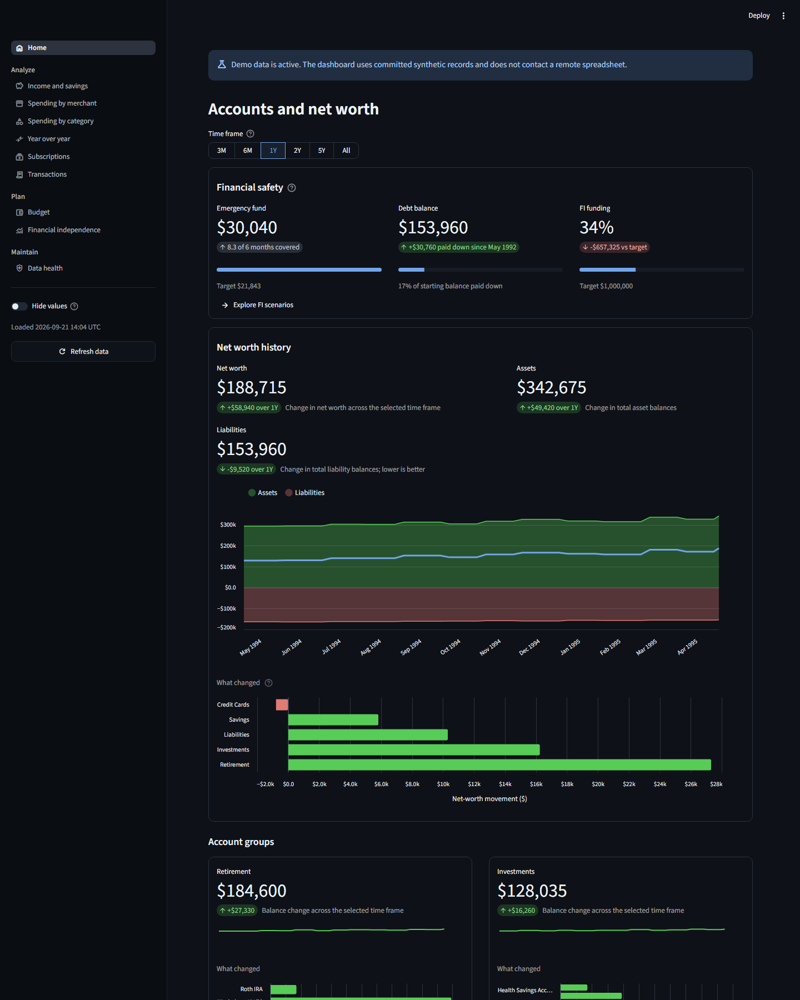
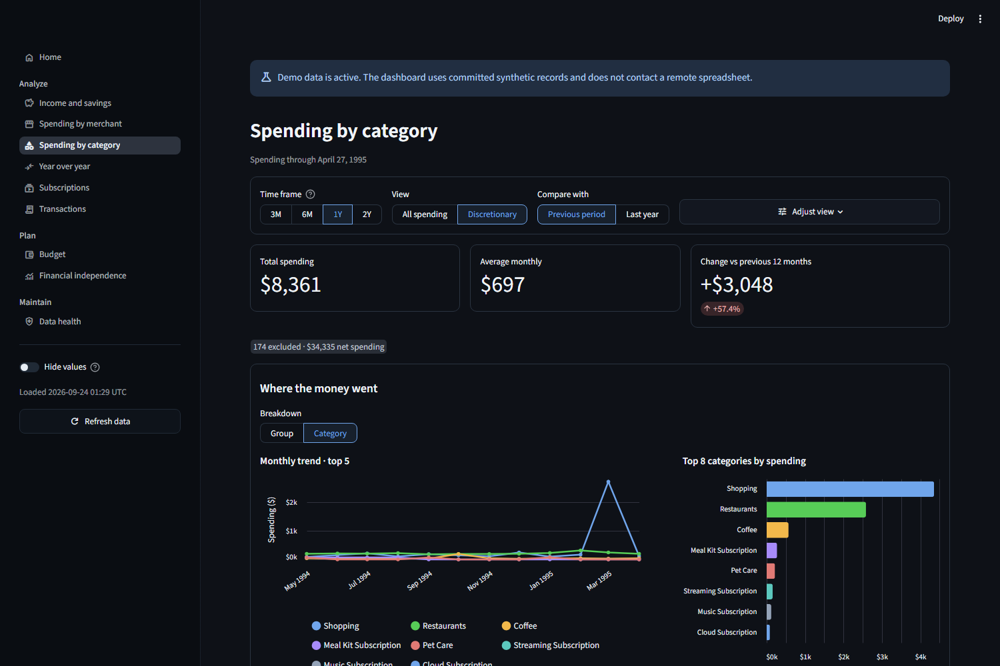
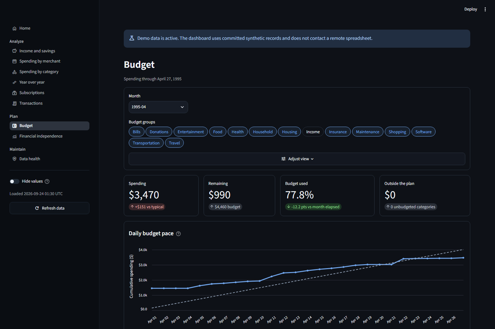
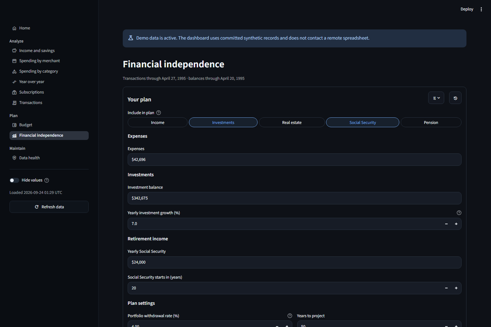
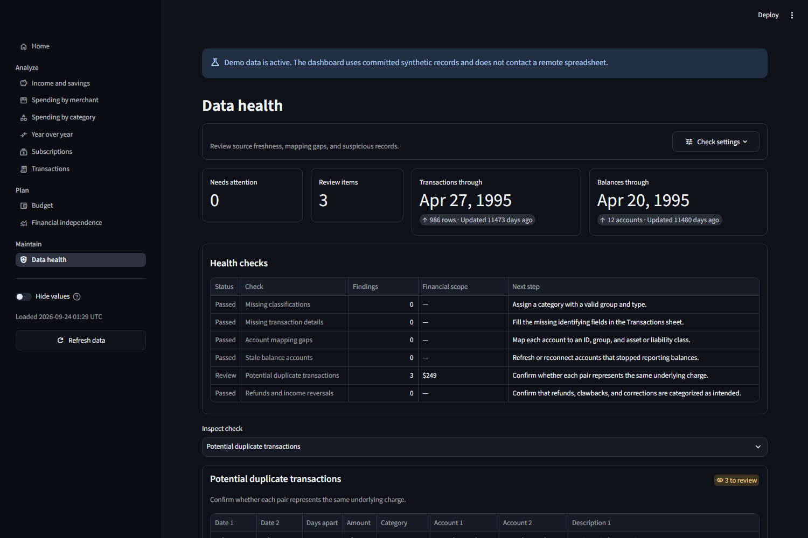

<p align="center">
  
</p>

<h1 align="center">Portico</h1>

<p align="center">
  <strong>A private, self-hosted dashboard for your Google Sheets-powered finances.</strong>
</p>

<p align="center">
  <a href="https://nccurry.github.io/portico/">Try it out</a>
  |
  <a href="#connect-google-sheets">Connect Google Sheets</a>
  |
  <a href="#run-portico-on-linux">Run on Linux</a>
  |
  <a href="#development">Develop</a>
</p>

<p align="center">
  <a href="https://github.com/nccurry/portico/actions/workflows/ci.yml"></a>
  <a href="pyproject.toml"></a>
  <a href="https://github.com/nccurry/portico/actions/workflows/ci.yml"></a>
  <a href="https://nccurry.github.io/portico/"></a>
  <a href="LICENSE"></a>
  <a href="https://github.com/nccurry/portico/releases/latest"></a>
</p>

---

Portico turns a Google Sheets workbook into focused views for income, spending,
subscriptions, budgets, net worth, financial safety, financial independence, and
data health. The app reads your sheets but does not change them.

Portico works with any Google Sheets workbook that has the required tabs and
columns. Its data model follows the
[Tiller Foundation Template](https://help.tiller.com/en/articles/3250724-what-is-the-tiller-foundation-template),
which is the recommended starting point.

The repository includes synthetic data. You can explore every dashboard without
a Tiller account or a Google Sheets workbook.

## Screenshots

These screenshots use the committed synthetic data. They contain no personal
financial records.

<p align="center">
  
</p>

### Spending analysis



### Budget tracking



### Financial independence



### Data health



## Try the demo

[Try it out in your browser](https://nccurry.github.io/portico/).

### Run the demo locally

Install Docker Engine. Then pull the latest release and start the demo:

```console
docker pull ghcr.io/nccurry/portico:latest
docker run --rm --init --name portico \
  --read-only --tmpfs /tmp:size=64m,mode=1777 \
  --cap-drop ALL --security-opt no-new-privileges:true \
  --env PORTICO_DATA_SOURCE=demo \
  --publish 127.0.0.1:8501:8501 \
  ghcr.io/nccurry/portico:latest
```

Open <http://127.0.0.1:8501>. The local demo accepts connections only from the
local computer. It does not load Streamlit secrets or contact Google Sheets.

Press `Ctrl+C` to stop the demo.

## Connect Google Sheets

Google Sheets is the only supported live data source. No service account is
required.

Clone the repository to get the configuration and secrets templates:

```console
git clone https://github.com/nccurry/portico.git
cd portico
```

### Prepare the workbook

Create these four tabs:

- Transactions
- Balance History
- Categories
- Accounts

The Tiller Foundation Template already has these tabs and the expected columns.
Other workbooks work when their columns match the schema in this README.

For each tab, set **General access** to **Anyone with the link** and select the
**Viewer** role. Anyone who gets a sheet URL can read that sheet. Treat each URL
as private.

### Add the sheet URLs

Copy the secrets template:

```console
cp .streamlit/secrets.example.toml .streamlit/secrets.toml
chmod 600 .streamlit/secrets.toml
```

The container runs as Linux user and group ID `1000`, which matches the first
normal user on most Linux systems. The file must be owned by that user so the
container can read it without making it public to other host users.

Open `.streamlit/secrets.toml`. Replace each example URL with the full URL for
the matching tab. Each URL must use `https://docs.google.com` and include the
numeric `gid` for that tab.

Never commit `.streamlit/secrets.toml`. Git ignores this file by default.

### Check and start Portico

Create an empty local override file, then pull the latest image and check the
workbook:

```console
touch config/local.toml
docker pull ghcr.io/nccurry/portico:latest
docker run --rm \
  --env PORTICO_DATA_SOURCE=google_sheets \
  --mount "type=bind,source=$(pwd)/config/local.toml,target=/app/config/local.toml,readonly" \
  --mount "type=bind,source=$(pwd)/.streamlit/secrets.toml,target=/app/.streamlit/secrets.toml,readonly" \
  ghcr.io/nccurry/portico:latest python -m scripts.doctor
```

The check reads each sheet and validates its basic structure. It does not print
sheet URLs or financial rows.

Start Portico:

```console
cp .env.example .env
docker volume create portico-state
docker run --detach --init --name portico --restart unless-stopped \
  --read-only --tmpfs /tmp:size=64m,mode=1777 \
  --cap-drop ALL --security-opt no-new-privileges:true \
  --env-file .env \
  --mount "type=bind,source=$(pwd)/config/local.toml,target=/app/config/local.toml,readonly" \
  --mount "type=bind,source=$(pwd)/.streamlit/secrets.toml,target=/app/.streamlit/secrets.toml,readonly" \
  --mount "type=volume,source=portico-state,target=/app/.local" \
  --publish 127.0.0.1:8501:8501 \
  ghcr.io/nccurry/portico:latest
```

Open <http://127.0.0.1:8501>.

## Google Sheets schema

Column names are case-sensitive. Portico ignores unknown columns.

### Transactions

Required columns:

`Date`, `Category`, `Amount`, `Account`, `Month`, `Week`, `Full Description`,
`Institution`, `Account #`, `Date Added`, and `Categorized Date`.

Dates must use a format that pandas can read. Amounts can contain dollar signs
and commas. Tiller normally records expenses as negative values and income as
positive values.

### Balance History

Required columns:

`Date`, `Time`, `Balance`, `Account`, `Account #`, `Account ID`, `Institution`,
`Class`, `Month`, `Week`, and `Date Added`.

Portico also reads account type, status, and group columns from standard Tiller
sheets when those columns exist.

### Categories

Required columns:

`Category`, `Group`, `Type`, and `Hide From Reports`.

Portico treats later columns with date names as monthly budget columns. Budget
values can contain dollar signs and commas.

### Accounts

The sheet must contain at least four columns. Portico treats the first four as
`Account`, `Class Override`, `Group`, and `Hide`. It ignores later columns.

## Run Portico on Linux

The container is the supported deployment method. It runs as a non-root user,
uses a read-only filesystem, and includes a health check.

### Common commands

Show service and health status:

```console
docker ps --filter name=^/portico$
docker inspect portico --format '{{.State.Health.Status}}'
```

Follow the logs:

```console
docker logs --follow portico
```

Stop and remove the container:

```console
docker stop portico
docker rm portico
```

Update Portico:

```console
docker pull ghcr.io/nccurry/portico:latest
docker stop portico
docker rm portico
# Run the same docker run command from the setup section.
```

Use `ghcr.io/nccurry/portico:1.1.0` instead of `latest` when you want to pin an
exact release.

Portico stores configuration and secrets on the host. The `portico-state`
volume records successful Discord delivery periods so an update does not send a
duplicate report.

### Network access

The default address is `127.0.0.1:8501`. Only the Linux host can connect to this
address.

To use a different host port, change the left side of `--publish`:

```console
--publish 127.0.0.1:8601:8501
```

To accept connections from a trusted local network, change the address:

```console
--publish 0.0.0.0:8501:8501
```

Portico has no login screen. Do not forward its port to the public internet. A
public deployment requires an authenticated TLS reverse proxy.

Copy `.env.example` to `.env` to keep the application timezone and Discord
schedule between container runs. The host address and port stay in the
`--publish` argument.

## Configuration

Tracked defaults live in [`config/defaults.toml`](config/defaults.toml). The
defaults match the maintainer's Tiller setup, but contain no private account or
transaction data. They cover report periods, calculation policies, thresholds,
subscription detection, emergency-fund and debt targets, financial-independence
assumptions, Discord summary windows, and merchant aliases.

Create the ignored file `config/local.toml`. Add only the values that differ
from the defaults. Portico stops with an error
for unknown keys, wrong types, unsafe paths, duplicate values, and values outside
the supported ranges. Restart Portico after changing a TOML file.

### Dashboard settings

These are the main settings most households may want to override:

| Section | Setting | What it controls |
| --- | --- | --- |
| `reporting` | `lookback_months` | Calendar-month choices shown on income, spending, and merchant pages. Use 2–5 ascending values. |
| `reporting` | `default_lookback_months` | Initially selected reporting period. It must appear in `lookback_months`. |
| `spending` | `default_view` | Start spending and merchant pages in the configured view with this key. |
| `spending.views.<key>` | `label`, `include_*`, `exclude_*` | Defines a spending view shared by category, merchant, and discretionary year-over-year reports. `*_transactions_like` matches case-insensitive, literal text in Tiller’s Full Description; include rules form a union and exclusions win. |
| `income_savings` | `default_view` | Start income and savings in `regular` or `actual` view. |
| `income_savings` | `exclude_categories`, `exclude_groups` | One-off activity removed from the Regular calculation. |
| `income_savings` | `target_rate` | Savings-rate target shown on the income page. |
| `thresholds` | `expense`, `income` | Default limits offered by the large-transaction filters. |
| `budget` | `history_months` | Months used for budget history and trailing results. |
| `subscriptions` | `known_category_terms` | Text used to select the initial known-subscription categories. |
| `subscriptions` | `minimum_confidence`, `stale_after_days` | Discovery cutoff and stale-data warning. |
| `subscriptions` | `default_exclude_categories` | Categories selected by default in Additional discovery exclusions. |
| `year_over_year` | `utility_group_terms`, `utility_category_terms` | Text used by the Utility bills preset. |
| `data_health` | `stale_account_days` | Age at which an account balance is stale. |
| `data_health` | `duplicate_require_same_*` | Initial duplicate-detection matching rules. |
| `financial_independence` | FI funding target, return, withdrawal, history, projection, account, and group settings | Home-page FI funding progress and FI scenario assumptions. |
| `financial_safety` | Emergency-fund target, expense baseline, liquid-account scope, and debt baseline | Home-page safety progress. Emergency spending uses complete months only; leave `debt_baseline_date` empty to use the first recorded balance. |
| `weekly_summary` | `average_weeks`, `rolling_weeks`, `top_merchant_count` | Discord comparison windows and merchant detail. |
| `merchants.aliases` | Merchant name and description fragments | Combine several transaction descriptions under one merchant name. |

The page controls remain editable. They let you try another view without
changing the TOML file. Those choices last for the browser session only.

### Configure a Docker deployment

The image owns `/app/config/defaults.toml`. The setup command mounts only the
ignored local override file at `/app/config/local.toml`, so upgrades always use
the defaults shipped with that release.

Create and edit the override on the Docker host:

```console
touch config/local.toml
nano config/local.toml
docker restart portico
```

The bind mount is read-only to Portico. Editing the host file is enough; do not
edit files inside the container. Do not mount a host directory over
`/app/config`; that hides release defaults and can make a newer image fail to
start.

For an existing directory-mounted deployment, move household changes to
`config/local.toml`, remove the directory mount, and recreate the container
with the start command above. A host `defaults.toml` is no longer needed.

To keep the override under another name, set its path inside the container:

```console
PORTICO_CONFIG_PATH=/app/config/household.toml
```

Add that line to `.env`, create `config/household.toml`, and replace the
`local.toml` mount in the start command with:

```console
--mount "type=bind,source=$(pwd)/config/household.toml,target=/app/config/household.toml,readonly"
```

Environment variables are fixed when Docker creates the container, so remove
the existing container and run the start command again:

```console
docker stop portico
docker rm portico
# Run the docker run command from "Start Portico" again.
```

The named `portico-state` volume remains available.

These environment variables change the main application settings:

| Variable | Use |
| --- | --- |
| `PORTICO_CONFIG_PATH` | Select a different local TOML file. |
| `PORTICO_DATA_SOURCE` | Select `google_sheets` or `demo`. |
| `PORTICO_DISCORD_ENABLED` | Set to `true` to enable scheduled Discord summaries. The default is `false`. |
| `PORTICO_DISCORD_CRON` | Set the five-field cron schedule. The default is `0 9 * * 0` (Sunday at 9:00 AM). |
| `TZ` | Set the IANA timezone used by the Discord schedule, such as `America/Chicago`. |

Keep household category names, account names, and merchant aliases in
`config/local.toml`. Keep Google Sheets and Discord URLs in
`.streamlit/secrets.toml`.

## Optional Discord summary

Portico can send a weekly expense summary to a Discord channel. It reads the
Transactions and Categories tabs. You select which expense categories the
message follows.

The report includes:

- Spending for each selected category
- The change from its trailing weekly average
- The largest vendors in each category
- A comparison between the latest group of weeks and the prior group
- Total expenses and the number of uncategorized transactions

The tracked defaults use an eight-week average, a four-week comparison, and
three merchants per category. Change those values under `[weekly_summary]` in
`config/local.toml`.

### Create the Discord webhook

1. Open **Server Settings** in Discord.
2. Select **Integrations**, then **Webhooks**.
3. Create a webhook named `Portico`.
4. Select the private channel that will receive the report.
5. Copy the webhook URL.

Discord recommends an incoming webhook for a service that only sends messages.
Portico does not require a Discord bot or Discord application.

Add the URL and exact category names to `.streamlit/secrets.toml`:

```toml
[notifications.discord]
webhook_url = "https://discord.com/api/webhooks/<webhook-id>/<webhook-token>"
categories = ["Everyday Food", "Local Dining"]
```

Each category must exist in the Categories tab and use the `Expense` type.
Treat the webhook URL as a password.

### Preview and test the message

The notifier runs inside the same container as the dashboard. Check its
configuration, Google Sheets access, selected categories, webhook, and timezone:

```console
docker exec portico python -m src.discord_notifier check
```

Preview the report without contacting Discord:

```console
docker exec portico python -m src.discord_notifier preview
```

Send a test message that contains no financial data:

```console
docker exec portico python -m src.discord_notifier test
```

Send the latest completed weekly report:

```console
docker exec portico python -m src.discord_notifier send
```

The notifier stores sent periods in the `portico-state` Docker volume. It skips
a period after a successful send.

### Example message

Discord displays the report as a colored embed. A report with synthetic values
looks like this:

```text
Weekly spending
Jul 26 - Aug 1, 2026

Watched categories
Everyday Food — $120.00 · $20.00 above usual
Top vendors: KROGER $80.00 · ALDI $40.00
Local Dining — $40.00 · $20.00 below usual
Top vendors: CAFE $40.00

Watched total: $160.00
4-week watched total: $680.00 · $20.00 less than prior 4 weeks
All expenses: $900.00
Needs categorization: 4 transactions
```

### Enable the schedule

Scheduled summaries are disabled by default. Set these values in `.env`:

```dotenv
TZ=America/Chicago
PORTICO_DISCORD_ENABLED=true
PORTICO_DISCORD_CRON=0 9 * * 0
```

The cron value has five fields: minute, hour, day of month, month, and day of
week. The example sends each Sunday at 9:00 AM in the `TZ` timezone.

Restart the Portico container after changing `.env`. The container log shows
the next scheduled delivery time:

```console
docker logs portico
```

If the container is stopped at the scheduled time, that delivery is not run
later. You can send it manually with the `docker exec` command above. Successful
deliveries are recorded, so Portico does not send the same weekly period twice.

## Development

### Dev Container

The recommended setup is the repository Dev Container. Open the repository in
VS Code and choose **Dev Containers: Reopen in Container**. Then run:

```console
task demo
```

The container includes the pinned Python, uv, Task, Docker CLI, Buildx, and
development dependencies.

### Native bootstrap

The bootstrap installs all tools inside the repository. It does not change the
system Python installation.

On Linux:

```console
sh scripts/bootstrap.sh
.tools/bin/task demo
```

On Windows PowerShell:

```powershell
powershell -NoProfile -ExecutionPolicy Bypass -File scripts/bootstrap.ps1
.\.tools\bin\task.exe demo
```

You do not need a system Python, uv, Task, or mise installation.

### Direct uv commands

Contributors who already use uv can run:

```console
uv sync --locked --dev
uv run --locked ruff check .
uv run --locked mypy
uv run --locked pytest
```

Set `PORTICO_DATA_SOURCE=demo` and run
`uv run --locked streamlit run Home.py` to start the synthetic demo without
Task. PowerShell uses `$env:PORTICO_DATA_SOURCE = "demo"`.

### Checks

Task provides short names for the same local checks that CI runs:

```console
.tools/bin/task check
.tools/bin/task container:smoke
```

In PowerShell, replace `.tools/bin/task` with `.\.tools\bin\task.exe`.

Read [CONTRIBUTING.md](CONTRIBUTING.md) before you submit a change. Community
participation follows the [Code of Conduct](CODE_OF_CONDUCT.md).
Read the [architecture guide](docs/architecture.md) before you design a feature.

## Security and scope

Portico is a personal application with no login screen. Source commands and
container ports use `127.0.0.1` by default. Read [SECURITY.md](SECURITY.md) before
you expose the app beyond the local computer.

This project is independent. Tiller Money does not endorse or maintain it.

## License

Copyright 2026 Nick Curry and contributors.

Portico uses the [Apache License 2.0](LICENSE).
