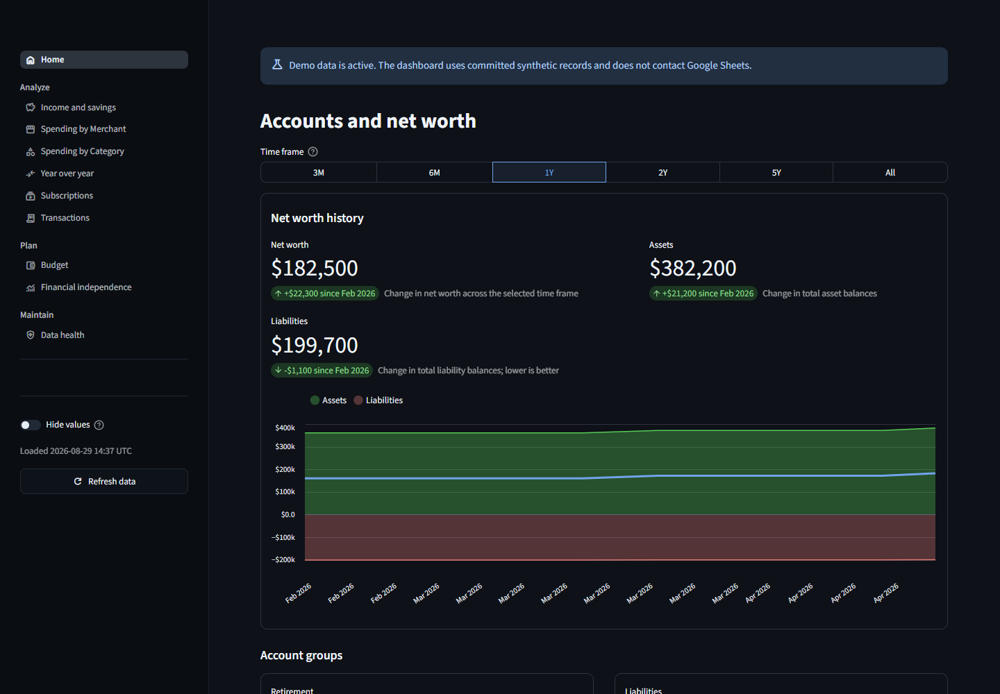
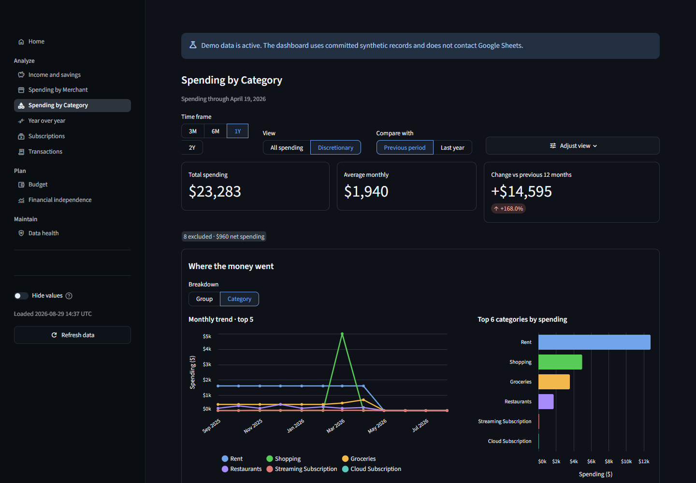
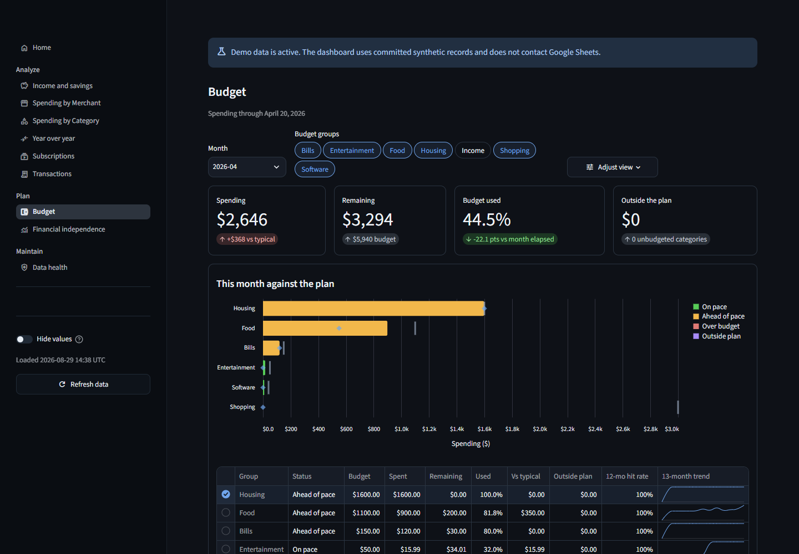
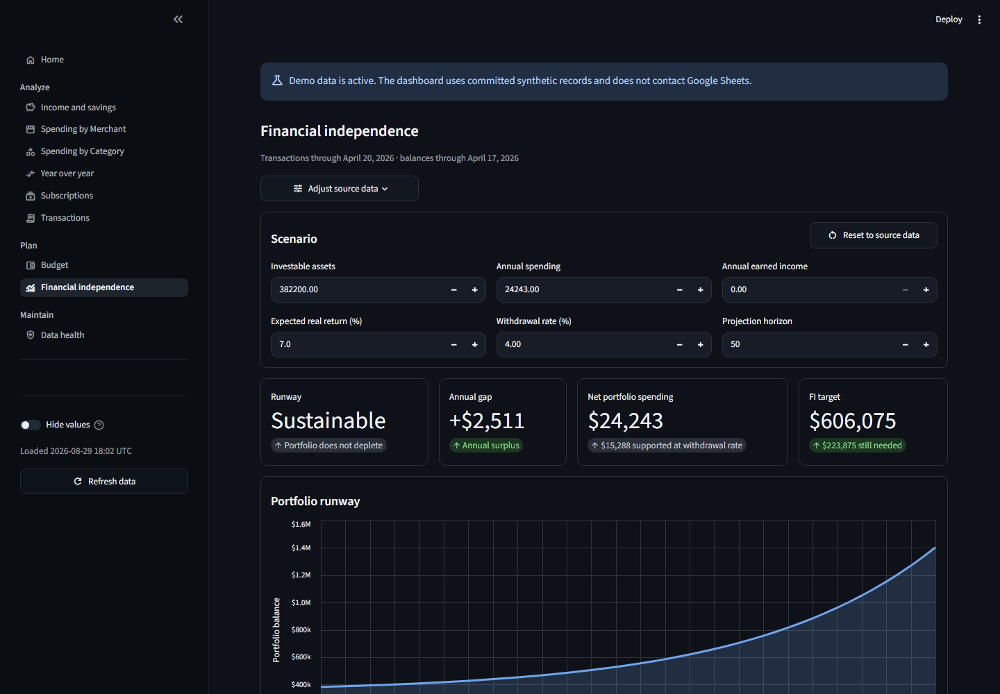
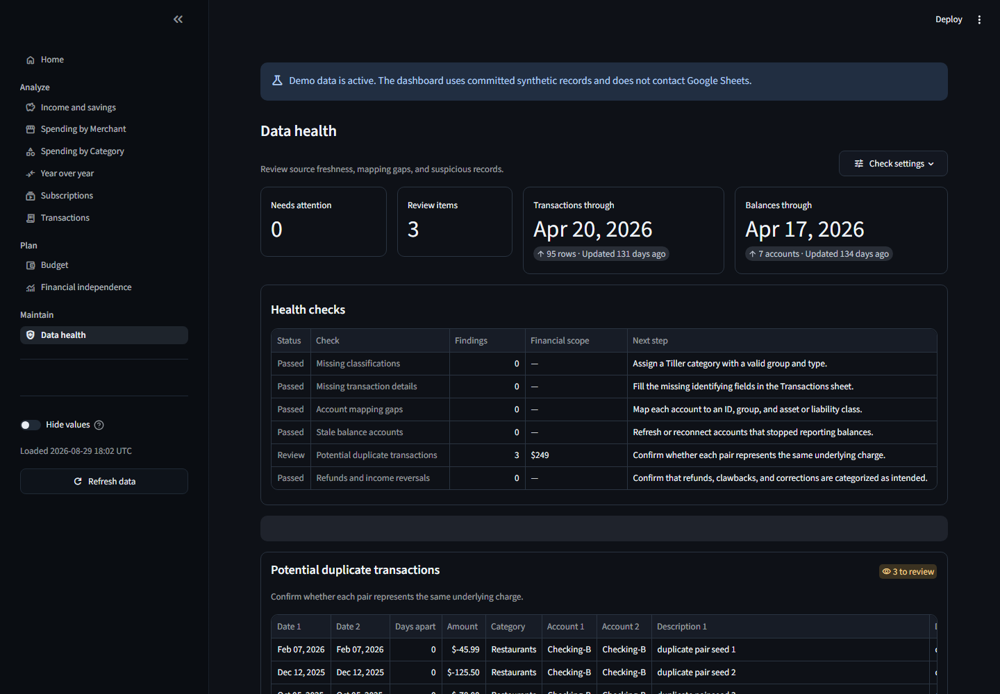

<p align="center">
  
</p>

<h1 align="center">Portico</h1>

<p align="center">
  <strong>A private, self-hosted dashboard for your Tiller-powered finances.</strong>
</p>

<p align="center">
  <a href="#try-the-demo">Try the demo</a>
  |
  <a href="docs/deployment.md">Deploy on Linux</a>
  |
  <a href="docs/quickstart.md">Connect Google Sheets</a>
  |
  <a href="CONTRIBUTING.md">Contribute</a>
</p>

<p align="center">
  <a href="https://github.com/nccurry/portico/actions/workflows/ci.yml"></a>
  <a href="pyproject.toml"></a>
  <a href="#try-the-demo"></a>
  <a href="docs/deployment.md"></a>
  <a href="#live-google-sheets"></a>
  <a href="LICENSE"></a>
</p>

---

Portico turns a Tiller workbook into focused views for income, spending,
subscriptions, budgets, net worth, financial independence, and data health. It is
read-only: the app analyzes your sheets but does not change them.

The repository includes synthetic data, so you can explore every dashboard
without a Tiller account or Google Sheet.

## Explore the demo

These screenshots use the committed synthetic dataset. The demo does not contact Google Sheets.

<p align="center">
  
</p>

### Spending analysis



### Budget tracking



### Financial independence



### Data health



## Try the demo

On Linux, clone the repository and run:

```console
docker compose --profile demo up --build demo
```

Open <http://127.0.0.1:8501>. The demo binds only to your computer, makes no
Google Sheets connection, and displays a banner whenever synthetic data is in
use.

Stop the demo with `Ctrl+C`. See [the quick start](docs/quickstart.md) when you
are ready to connect a Tiller workbook.

## What is included

- Income, savings-rate, and spending trends
- Category and merchant analysis
- Recurring-subscription detection
- Budget performance and transaction drill-downs
- Net-worth and financial-independence projections
- Duplicate, stale-account, and mapping checks
- A global control that hides financial values on screen
- Validated settings with tracked defaults and ignored local overrides

## Live Google Sheets

Google Sheets is the only supported live data source. The app reads four
link-readable Tiller tabs: Transactions, Balance History, Categories, and
Accounts. No service account is required.

```console
cp .streamlit/secrets.example.toml .streamlit/secrets.toml
docker compose build live
docker compose --profile live run --rm --no-deps live python -m scripts.doctor
docker compose --profile live up --build live
```

Add each tab URL, including its numeric `gid`, before running the doctor. Anyone
with a link-readable sheet URL may be able to read that sheet, so treat the URLs
as private and never commit `.streamlit/secrets.toml`.

See [the quick start](docs/quickstart.md), [Linux deployment guide](docs/deployment.md),
[configuration reference](docs/configuration.md), and [data schema](docs/data-schema.md).

## Development

Bootstrap the source environment before development:

```console
sh scripts/bootstrap.sh
```

The main local checks are:

```console
.tools/bin/task privacy:check
.tools/bin/task lint
.tools/bin/task test
```

Use `.tools/bin/task demo` for a source-based demo. Use
`.tools/bin/task run:lan` only on a trusted network.

See [CONTRIBUTING.md](CONTRIBUTING.md) for the contributor workflow and
[CHANGELOG.md](CHANGELOG.md) for notable changes.

## Security and scope

Portico is a personal application with no login screen. The default
source and container commands publish to `127.0.0.1`. Do not expose the app
directly to the public internet. See [SECURITY.md](SECURITY.md).

This project is an independent community project. It is not affiliated with,
endorsed by, or maintained by Tiller Money.

## License

Copyright 2026 Nick Curry and contributors.

Licensed under the [Apache License 2.0](LICENSE).
