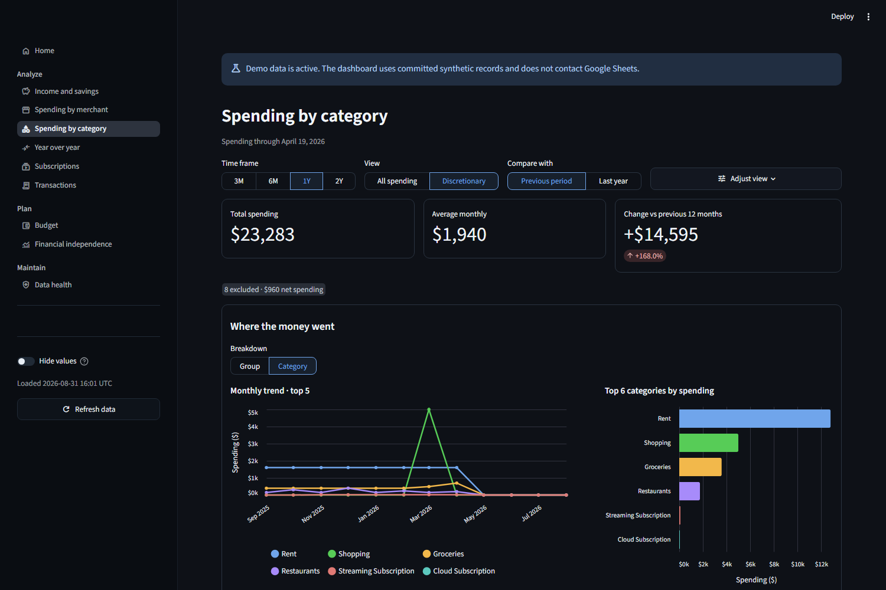
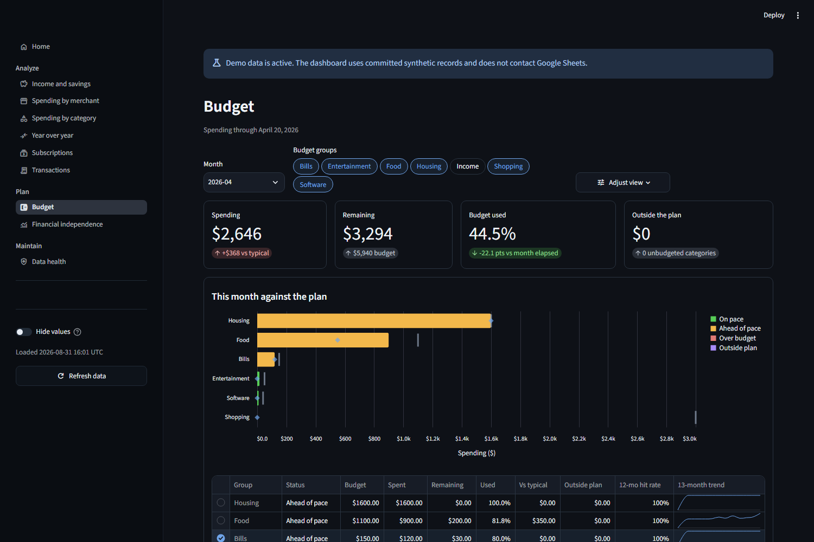
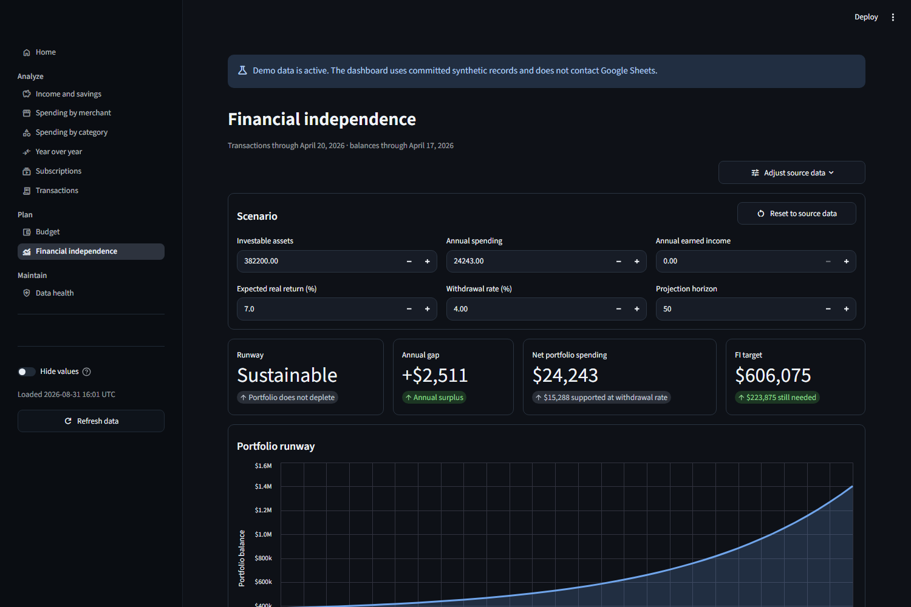
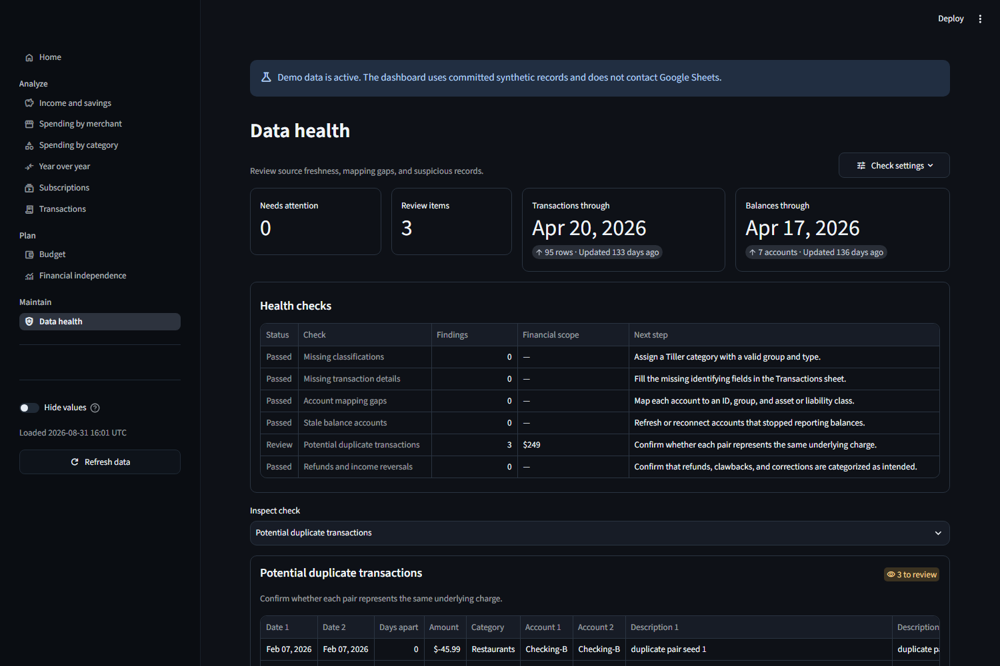

> **Legacy reference only.** This Streamlit application is archived. Portico's
> active future is the .NET application at the repository root. Historical
> paths may no longer form a runnable deployment; use this code to understand
> prior behavior, not as an active runtime.

<p align="center">
  
</p>

<h1 align="center">Portico</h1>

<p align="center">
  <strong>A private, self-hosted dashboard for your spreadsheet-powered finances.</strong>
</p>

<p align="center">
  <a href="https://nccurry.github.io/portico/">Try it out</a>
  |
  <a href="#connect-a-spreadsheet">Connect a spreadsheet</a>
  |
  <a href="#run-portico-on-linux">Run on Linux</a>
  |
  <a href="#development">Develop</a>
</p>

<p align="center">
  <a href="https://github.com/nccurry/portico/actions/workflows/ci.yml"></a>
  <a href="pyproject.toml"></a>
  <a href="https://github.com/nccurry/portico/actions/workflows/ci.yml"></a>
  <a href="https://nccurry.github.io/portico/"></a>
  <a href="LICENSE"></a>
  <a href="https://github.com/nccurry/portico/releases/latest"></a>
</p>

---

Portico turns spreadsheet data into focused views for income, spending,
subscriptions, budgets, net worth, financial safety, financial independence, and
data health. The app reads your data but does not change it.

Use either a remote spreadsheet or local CSV files with the required tables and
columns. The current remote connection reads Google Sheets. The table layout is
compatible with the
[Tiller Foundation Template](https://help.tiller.com/en/articles/3250724-what-is-the-tiller-foundation-template),
but Portico uses the table contract rather than a provider-specific account.

The repository includes synthetic data, so you can explore every dashboard
without a remote spreadsheet.

## Screenshots

These screenshots use the committed synthetic data. They contain no personal
financial records.

<p align="center">
  
</p>

### Spending analysis



### Budget tracking



### Financial independence



### Data health



## Roci desktop dashboard

This worktree contains an experimental C# desktop dashboard built with Roci.
It keeps finance rules, data loading, configuration, and rendering separate.

The project expects the companion Roci worktree at `../roci-portico-components`.
Set `RociSourceRoot` if your Roci checkout is in another location.

### Start the dashboard

From PowerShell in this working tree, run:

```powershell
task roci:restore
task roci:run
```

The default command reads the synthetic CSV files in `demo/data`.
It opens the ten pages in `dashboard.toml`.
Use the permanent left rail to move between pages.
Page controls rebuild the report without changing the workbook.

Run this check without opening a window:

```powershell
task roci:doctor -- --output json
```

To load public Google Sheets, copy `portico.secrets.example.toml` to
`portico.secrets.toml`. Replace the four URLs. Then run:

```powershell
task roci:run -- --config .\config.toml --dashboard .\dashboard.toml --source google-sheets --secrets .\portico.secrets.toml
```

The CLI provides `run` and `doctor` commands.
It accepts `--config`, `--dashboard`, `--source`, `--data-dir`, and `--secrets`.
It also accepts repeatable `--sheet NAME=URL` values.
The app reads sheet URLs only. It does not print them in diagnostics.

`dashboard.toml` controls the desktop presentation. It defines page order,
rail labels, page headings, sections, controls, widgets, spans, and chart
kinds. The finance TOML keeps the calculation rules. `combo_chart` combines
category bars with connected lines; its `bar_series` list names the report
series that render as bars. Other series
render as lines. The app rejects an invalid widget or filter before it opens a
window.

### Build and test the desktop project

```powershell
task roci:build:strict
task roci:test
task roci:visual
task roci:publish:win-x64
task roci:publish:linux-x64
```

`task roci:visual` writes and validates 48 PNG files in
`artifacts/visual/portico-current`. It captures 24 named page states at 1500 by
1000 and 1024 by 720.

The publish tasks create one self-contained executable in each
`artifacts/publish` folder. They do not use Native AOT. After the Windows task
finishes, launch the published app from this directory with:

```powershell
.\artifacts\publish\win-x64\portico.exe doctor --output json
.\artifacts\publish\win-x64\portico.exe run
```

On Linux, use:

```console
./artifacts/publish/linux-x64/portico doctor --output json
./artifacts/publish/linux-x64/portico run
```

## Try the demo

[Try it out in your browser](https://nccurry.github.io/portico/).

### Run the demo locally

Install Docker Engine. Then pull the current release and start the demo:

```console
docker pull ghcr.io/nccurry/portico:1.3.0
docker run --rm --init --name portico \
  --read-only --tmpfs /tmp:size=64m,mode=1777 \
  --cap-drop ALL --security-opt no-new-privileges:true \
  --env PORTICO_CONFIG_PATH=/app/portico-demo.toml \
  --publish 127.0.0.1:8501:8501 \
  ghcr.io/nccurry/portico:1.3.0
```

Open <http://127.0.0.1:8501>. The local demo accepts connections only from the
local computer. It does not load Streamlit secrets or contact a remote spreadsheet.

Press `Ctrl+C` to stop the demo.

## Connect a spreadsheet

Portico uses a remote spreadsheet by default. The included remote connection
uses Google Sheets and does not require a service account. You can instead use
local CSV files; see [Use local CSV data](#use-local-csv-data).

Clone the repository to get the configuration and secrets templates:

```console
git clone https://github.com/nccurry/portico.git
cd portico
```

### Prepare the workbook

Create these four tabs:

- Transactions
- Balance History
- Categories
- Accounts

Any workbook works when its columns match the schema in this README.

For each tab, set **General access** to **Anyone with the link** and select the
**Viewer** role. Anyone who gets a sheet URL can read that sheet. Treat each URL
as private.

### Add the sheet URLs

Copy the secrets template:

```console
cp .streamlit/secrets.example.toml .streamlit/secrets.toml
chmod 600 .streamlit/secrets.toml
```

The container runs as Linux user and group ID `1000`, which matches the first
normal user on most Linux systems. The file must be owned by that user so the
container can read it without making it public to other host users.

Open `.streamlit/secrets.toml`. Replace each example URL with the full URL for
the matching tab. Each URL must use `https://docs.google.com` and include the
numeric `gid` for that tab.

Never commit `.streamlit/secrets.toml`. Git ignores this file by default.

### Configure Portico

Edit `config.toml` directly. It is a complete configuration file, not an
overlay. Replace its selectors with exact values from your spreadsheet:

```console
nano config.toml
```

### Check and start Portico

Set the exact image release in `.env`, then check the workbook:

```console
docker volume create portico-state
cp .env.example .env
docker compose pull
docker compose run --rm app python -m scripts.doctor
```

The check reads each sheet and validates its basic structure. It does not print
sheet URLs or financial rows.

Start Portico:

```console
docker compose up --detach
```

Open <http://127.0.0.1:8501>.

### Upgrade from Portico 1.2

Portico 1.3 removes Discord's private category list. Before upgrading, back up
`config.toml` and `.streamlit/secrets.toml`, then move the selection into the
existing named transaction sets:

```toml
[weekly_summary]
watched_transaction_sets = ["discretionary"]
average_weeks = 48
rolling_weeks = 4
top_merchant_count = 3
```

Remove `notifications.discord.categories` from `.streamlit/secrets.toml`. Keep
the `portico-state` volume: it preserves delivered-period records and prevents
the new Compose service from sending a duplicate summary.

## Spreadsheet schema

Column names are case-sensitive. Portico ignores unknown columns.

### Transactions

Required columns:

`Date`, `Category`, `Amount`, `Account`, `Month`, `Week`, `Full Description`,
`Institution`, `Account #`, `Date Added`, and `Categorized Date`.

Dates must use a format that pandas can read. Amounts can contain dollar signs
and commas. Expenses normally use negative values and income uses positive values.

### Balance History

Required columns:

`Date`, `Time`, `Balance`, `Account`, `Account #`, `Account ID`, `Institution`,
`Class`, `Month`, `Week`, and `Date Added`.

Portico also reads account type, status, and group columns when they exist.

### Categories

Required columns:

`Category`, `Group`, `Type`, and `Hide From Reports`.

Portico treats later columns with date names as monthly budget columns. Budget
values can contain dollar signs and commas.

### Accounts

The sheet must contain at least four columns. Portico treats the first four as
`Account`, `Class Override`, `Group`, and `Hide`. It ignores later columns.

## Run Portico on Linux

The container is the supported deployment method. It runs as a non-root user,
uses a read-only filesystem, and includes a health check.

### Common commands

Show service and health status:

```console
docker compose ps
```

Follow the logs:

```console
docker compose logs --follow app
```

Stop and remove the container:

```console
docker compose down
```

Update Portico:

```console
docker compose pull
docker compose up --detach
```

Set `PORTICO_IMAGE` in `.env` to the exact release you want to run. Compose
never relies on a mutable `latest` image tag.

Portico stores configuration and secrets on the host. The `portico-state`
volume records successful Discord delivery periods so an update does not send a
duplicate report.

### Network access

The default address is `127.0.0.1:8501`. Only the Linux host can connect to this
address.

To use a different host port, set this in `.env`:

```dotenv
PORTICO_PUBLISH_PORT=8601
```

To accept connections from a trusted local network, set this in `.env`:

```dotenv
PORTICO_PUBLISH_ADDRESS=0.0.0.0
```

Portico has no login screen. Do not forward its port to the public internet. A
public deployment requires an authenticated TLS reverse proxy.

Copy `.env.example` to `.env` to keep the image tag, network address, timezone,
and Discord schedule in one deployment file.

## Configuration

[`config.toml`](config.toml) is the normal application configuration and the
field reference. It shows every supported setting, including empty selectors.
Edit it directly and keep it complete. Portico never loads or merges a second
configuration file during a normal run.

[`portico-demo.toml`](portico-demo.toml) is a separate complete configuration
for the committed synthetic data. The demo entry points select it explicitly.
The app shows the demo banner only when the selected file is named exactly
`portico-demo.toml`.

Portico stops with an error for unknown keys, wrong types, duplicate values, and
values outside the supported ranges. Restart Portico after changing a TOML file.
Reporting periods use the latest date in the loaded spreadsheet data; there is
no manual reference-date setting.

### Dashboard settings

Use exact values from your spreadsheet in `config.toml`. These are the main
settings you may want to change:

| Section | Setting | What it controls |
| --- | --- | --- |
| `lookback` | `lookback_months` | Calendar-month choices shown on income, spending, and merchant pages. Use 2–5 ascending values. |
| `lookback` | `default_lookback_months` | Initially selected reporting period. It must appear in `lookback_months`. |
| `data` | `source`, `directory` | Select `remote` for the configured remote spreadsheet or `local` for local CSV files. Local requires `directory`; remote leaves it empty. |
| `transaction_sets.<key>` | `label`, `groups`, `categories`, `accounts`, `merchants`, `transactions_like`, `includes`, `excludes` | Defines one reusable expense policy. Direct selectors and included sets are combined; excluded sets are removed last. A set with neither direct selectors nor includes means every expense row. Groups, categories, and accounts are exact sheet values; merchants use the shared merchant aliases; `transactions_like` is case-insensitive literal text in Full Description. |
| `filter_sets.<key>` | `options`, `default` | Lists the named transaction sets offered by a page. `spending` is shared by the category and merchant pages; `year_over_year` can expose a different set of choices. |
| `income_savings` | `default_view` | Start income and savings in `regular` or `actual` view. |
| `income_savings` | `exclude_categories`, `exclude_groups` | One-off activity removed from the Regular calculation. |
| `income_savings` | `target_rate` | Savings-rate target shown on the income page. |
| `thresholds` | `expense`, `income` | Default limits offered by the large-transaction filters. |
| `budget` | `history_months` | Months used for budget history and trailing results. |
| `subscriptions` | `known_categories`, `detection_excluded_categories` | Exact Categories-sheet values used for the known inventory and excluded from automatic discovery. |
| `subscriptions` | `minimum_confidence`, `stale_after_days` | Discovery cutoff and stale-data warning. |
| `subscriptions` | `default_exclude_categories` | Categories selected by default in Additional discovery exclusions. |
| `data_health` | `stale_account_days` | Age at which an account balance is stale. |
| `data_health` | `duplicate_require_same_*` | Initial duplicate-detection matching rules. |
| `financial_independence` | FI funding target, return, withdrawal, history, projection, account, and group settings | Home-page FI funding progress and FI scenario assumptions. |
| `financial_safety` | Emergency-fund target, expense baseline, liquid-account scope, and debt baseline | Home-page safety progress. Emergency spending uses complete months only; leave `debt_baseline_date` empty to use the first recorded balance. |
| `weekly_summary` | `watched_transaction_sets`, `average_weeks`, `rolling_weeks`, `top_merchant_count` | Named transaction sets, comparison windows, and merchant detail for Discord. |
| `merchants.aliases` | Merchant name and description fragments | Combine several transaction descriptions under one merchant name. |

The View controls choose among the configured transaction sets. Other page
controls can narrow that set for exploration, but cannot broaden it. Those
choices last for the browser session only.

### Use local CSV data

Local CSV is a first-class source, not a separate application mode. Edit the
same `config.toml` file and use the four exported files
`transactions.csv`, `balance_history.csv`, `categories.csv`, and `accounts.csv`:

```toml
[data]
source = "local"
directory = "/data"
```

`directory` may be absolute or relative to `config.toml`. The reports use the
latest date in the local files, just as they do for a remote spreadsheet.
[`portico-demo.toml`](portico-demo.toml) is the complete configuration for
`demo/data`.

For a Compose deployment, add the CSV directory in an ignored
`compose.override.yaml` next to `compose.yaml`:

```yaml
services:
  app:
    volumes:
      - ./data:/data:ro
```

### Configure a Docker deployment

`compose.yaml` is the supported deployment manifest. It mounts your complete
`config.toml` and `.streamlit/secrets.toml` as individual read-only files. Do
not mount a configuration directory over `/app`.

Compose recreates the service when the image or environment changes. After
changing either TOML file, recreate it explicitly:

```console
docker compose up --detach --force-recreate
```

The named `portico-state` volume remains available.

These environment variables change the main application settings:

| Variable | Use |
| --- | --- |
| `PORTICO_DISCORD_ENABLED` | Set to `true` to enable scheduled Discord summaries. The default is `false`. |
| `PORTICO_DISCORD_CRON` | Set the five-field cron schedule. The default is `0 9 * * 0` (Sunday at 9:00 AM). |
| `TZ` | Set the IANA timezone used by the Discord schedule, such as `America/Chicago`. |

Keep remote spreadsheet URLs and Discord URLs in `.streamlit/secrets.toml`.

## Optional Discord summary

Portico can send a weekly expense summary to a Discord channel. It reads the
Transactions and Categories tabs, then follows the named transaction sets in
`[weekly_summary].watched_transaction_sets`. This keeps the notifier aligned
with the Discretionary and other configured dashboard views.

The report includes:

- Current-week categories with activity in the selected transaction sets
- The change from its trailing weekly average
- The largest vendors in each category
- A comparison between the latest group of weeks and the prior group
- Total expenses plus the count and combined absolute amount of all outstanding
  uncategorized transactions, so refunds do not offset charges

Public defaults use a 48-week average, a four-week comparison, and three
merchants per category. Choose one or more transaction sets and change those
values under `[weekly_summary]` in `config.toml` when needed.

### Create the Discord webhook

1. Open **Server Settings** in Discord.
2. Select **Integrations**, then **Webhooks**.
3. Create a webhook named `Portico`.
4. Select the private channel that will receive the report.
5. Copy the webhook URL.

Discord recommends an incoming webhook for a service that only sends messages.
Portico does not require a Discord bot or Discord application.

Add only the URL to `.streamlit/secrets.toml`:

```toml
[notifications.discord]
webhook_url = "https://discord.com/api/webhooks/<webhook-id>/<webhook-token>"
```

Choose the report selection in `config.toml`, not in secrets. Treat the
webhook URL as a password.

### Preview and test the message

The notifier runs inside the same container as the dashboard. Check its
configuration, remote spreadsheet access, watched transaction sets, webhook, and timezone:

```console
docker compose exec app python -m src.discord_notifier check
```

Preview the report without contacting Discord:

```console
docker compose exec app python -m src.discord_notifier preview
```

Send a test message that contains no financial data:

```console
docker compose exec app python -m src.discord_notifier test
```

Send the latest completed weekly report:

```console
docker compose exec app python -m src.discord_notifier send
```

The notifier stores sent periods in the `portico-state` Docker volume. It skips
a period after a successful send.

### Example message

Discord displays the report as a colored embed. A report with synthetic values
looks like this:

```text
Weekly spending
Jul 26 - Aug 1, 2026

📊 Watched categories
Everyday Food — $120.00 · 🔴 ▲ $20.00 above usual
Top vendors: KROGER $80.00 · ALDI $40.00
Local Dining — $40.00 · 🟢 ▼ $20.00 below usual
Top vendors: CAFE $40.00

💳 Watched total: $160.00 · ⚪ — right at usual
📅 4-week watched total: $680.00 · 🟢 ▼ $20.00 less than prior 4 weeks
💵 All expenses: $900.00
🧾 Needs categorization: 4 transactions · $125.00
```

### Enable the schedule

Scheduled summaries are disabled by default. Set these values in `.env`:

```dotenv
TZ=America/Chicago
PORTICO_DISCORD_ENABLED=true
PORTICO_DISCORD_CRON=0 9 * * 0
```

The cron value has five fields: minute, hour, day of month, month, and day of
week. The example sends each Sunday at 9:00 AM in the `TZ` timezone.

Recreate the Compose service after changing `.env`. The container log shows the
next scheduled delivery time:

```console
docker compose up --detach --force-recreate
docker compose logs app
```

If the container is stopped at the scheduled time, that delivery is not run
later. You can send it manually with the `docker compose exec` command above. Successful
deliveries are recorded, so Portico does not send the same weekly period twice.

## Development

### Dev Container

The recommended setup is the repository Dev Container. Open the repository in
VS Code and choose **Dev Containers: Reopen in Container**. Then run:

```console
task demo
```

The container includes the pinned Python, uv, Task, Docker CLI, Buildx, and
development dependencies.

### Native bootstrap

The bootstrap installs all tools inside the repository. It does not change the
system Python installation.

On Linux:

```console
sh scripts/bootstrap.sh
.tools/bin/task demo
```

On Windows PowerShell:

```powershell
powershell -NoProfile -ExecutionPolicy Bypass -File scripts/bootstrap.ps1
.\.tools\bin\task.exe demo
```

You do not need a system Python, uv, Task, or mise installation.

### Direct uv commands

Contributors who already use uv can run:

```console
uv sync --locked --dev
uv run --locked ruff check .
uv run --locked mypy
uv run --locked pytest
```

Set `PORTICO_CONFIG_PATH=portico-demo.toml` and run
`uv run --locked streamlit run Home.py` to start the synthetic demo without
Task. PowerShell uses `$env:PORTICO_CONFIG_PATH = "portico-demo.toml"`.

### Checks

Task provides short names for the same local checks that CI runs:

```console
.tools/bin/task check
.tools/bin/task container:smoke
```

In PowerShell, replace `.tools/bin/task` with `.\.tools\bin\task.exe`.

Read [CONTRIBUTING.md](CONTRIBUTING.md) before you submit a change. Community
participation follows the [Code of Conduct](CODE_OF_CONDUCT.md).
Read the [architecture guide](docs/architecture.md) before you design a feature.

## Security and scope

Portico is a personal application with no login screen. Source commands and
container ports use `127.0.0.1` by default. Read [SECURITY.md](SECURITY.md) before
you expose the app beyond the local computer.

This project is independent. No spreadsheet provider endorses or maintains it.

## License

Copyright 2026 Nick Curry and contributors.

Portico uses the [Apache License 2.0](LICENSE).
